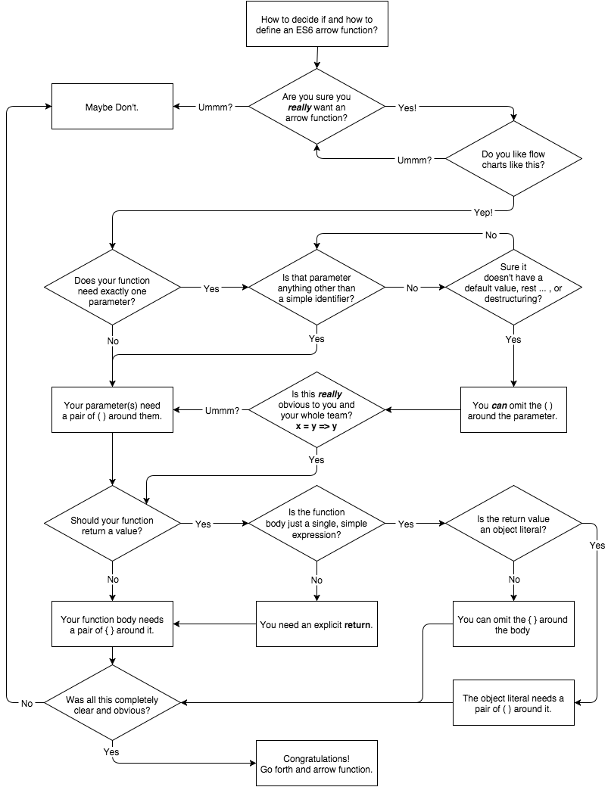

## Object Literal Extensions

ES6 adds a number of important convenience extensions to the humble `{ .. }` object literal.

### Concise Properties

You're certainly familiar with declaring object literals in this form:

```js
var x = 2, y = 3,
	o = {
		x: x,
		y: y
	};
```

If it's always felt redundant to say `x: x` all over, there's good news. If you need to define a property that is the same name as a lexical identifier, you can shorten it from `x: x` to `x`. Consider:

```js
var x = 2, y = 3,
	o = {
		x,
		y
	};
```

### Concise Methods

In a similar spirit to concise properties we just examined, functions attached to properties in object literals also have a concise form, for convenience.

The old way:

```js
var o = {
	x: function(){
		// ..
	},
	y: function(){
		// ..
	}
}
```

And as of ES6:

```js
var o = {
	x() {
		// ..
	},
	y() {
		// ..
	}
}
```

**Warning:** While `x() { .. }` seems to just be shorthand for `x: function(){ .. }`, concise methods have special behaviors that their older counterparts don't; specifically, the allowance for `super` (see "Object `super`" later in this chapter).

Generators (see Chapter 4) also have a concise method form:

```js
var o = {
	*foo() { .. }
};
```

#### Concisely Unnamed

While that convenience shorthand is quite attractive, there's a subtle gotcha to be aware of. To illustrate, let's examine pre-ES6 code like the following, which you might try to refactor to use concise methods:

```js
function runSomething(o) {
	var x = Math.random(),
		y = Math.random();

	return o.something( x, y );
}

runSomething( {
	something: function something(x,y) {
		if (x > y) {
			// recursively call with `x`
			// and `y` swapped
			return something( y, x );
		}

		return y - x;
	}
} );
```

This obviously silly code just generates two random numbers and subtracts the smaller from the bigger. But what's important here isn't what it does, but rather how it's defined. Let's focus on the object literal and function definition, as we see here:

```js
runSomething( {
	something: function something(x,y) {
		// ..
	}
} );
```

Why do we say both `something:` and `function something`? Isn't that redundant? Actually, no, both are needed for different purposes. The property `something` is how we can call `o.something(..)`, sort of like its public name. But the second `something` is a lexical name to refer to the function from inside itself, for recursion purposes.

Can you see why the line `return something(y,x)` needs the name `something` to refer to the function? There's no lexical name for the object, such that it could have said `return o.something(y,x)` or something of that sort.

That's actually a pretty common practice when the object literal does have an identifying name, such as:

```js
var controller = {
	makeRequest: function(..){
		// ..
		controller.makeRequest(..);
	}
};
```

Is this a good idea? Perhaps, perhaps not. You're assuming that the name `controller` will always point to the object in question. But it very well may not -- the `makeRequest(..)` function doesn't control the outer code and so can't force that to be the case. This could come back to bite you.

Others prefer to use `this` to define such things:

```js
var controller = {
	makeRequest: function(..){
		// ..
		this.makeRequest(..);
	}
};
```

That looks fine, and should work if you always invoke the method as `controller.makeRequest(..)`. But you now have a `this` binding gotcha if you do something like:

```js
btn.addEventListener( "click", controller.makeRequest, false );
```

Of course, you can solve that by passing `controller.makeRequest.bind(controller)` as the handler reference to bind the event to. But yuck -- it isn't very appealing.

Or what if your inner `this.makeRequest(..)` call needs to be made from a nested function? You'll have another `this` binding hazard, which people will often solve with the hacky `var self = this`, such as:

```js
var controller = {
	makeRequest: function(..){
		var self = this;

		btn.addEventListener( "click", function(){
			// ..
			self.makeRequest(..);
		}, false );
	}
};
```

More yuck.

**Note:** For more information on `this` binding rules and gotchas, see Chapters 1-2 of the *this & Object Prototypes* title of this series.

OK, what does all this have to do with concise methods? Recall our `something(..)` method definition:

```js
runSomething( {
	something: function something(x,y) {
		// ..
	}
} );
```

The second `something` here provides a super convenient lexical identifier that will always point to the function itself, giving us the perfect reference for recursion, event binding/unbinding, and so on -- no messing around with `this` or trying to use an untrustable object reference.

Great!

So, now we try to refactor that function reference to this ES6 concise method form:

```js
runSomething( {
	something(x,y) {
		if (x > y) {
			return something( y, x );
		}

		return y - x;
	}
} );
```

Seems fine at first glance, except this code will break. The `return something(..)` call will not find a `something` identifier, so you'll get a `ReferenceError`. Oops. But why?

The above ES6 snippet is interpreted as meaning:

```js
runSomething( {
	something: function(x,y){
		if (x > y) {
			return something( y, x );
		}

		return y - x;
	}
} );
```

Look closely. Do you see the problem? The concise method definition implies `something: function(x,y)`. See how the second `something` we were relying on has been omitted? In other words, concise methods imply anonymous function expressions.

Yeah, yuck.

**Note:** You may be tempted to think that `=>` arrow functions are a good solution here, but they're equally insufficient, as they're also anonymous function expressions. We'll cover them in "Arrow Functions" later in this chapter.

The partially redeeming news is that our `something(x,y)` concise method won't be totally anonymous. See "Function Names" in Chapter 7 for information about ES6 function name inference rules. That won't help us for our recursion, but it helps with debugging at least.

So what are we left to conclude about concise methods? They're short and sweet, and a nice convenience. But you should only use them if you're never going to need them to do recursion or event binding/unbinding. Otherwise, stick to your old-school `something: function something(..)` method definitions.

A lot of your methods are probably going to benefit from concise method definitions, so that's great news! Just be careful of the few where there's an un-naming hazard.

#### ES5 Getter/Setter

Technically, ES5 defined getter/setter literals forms, but they didn't seem to get used much, mostly due to the lack of transpilers to handle that new syntax (the only major new syntax added in ES5, really). So while it's not a new ES6 feature, we'll briefly refresh on that form, as it's probably going to be much more useful with ES6 going forward.

Consider:

```js
var o = {
	__id: 10,
	get id() { return this.__id++; },
	set id(v) { this.__id = v; }
}

o.id;			// 10
o.id;			// 11
o.id = 20;
o.id;			// 20

// and:
o.__id;			// 21
o.__id;			// 21 -- still!
```

These getter and setter literal forms are also present in classes; see Chapter 3.

**Warning:** It may not be obvious, but the setter literal must have exactly one declared parameter; omitting it or listing others is illegal syntax. The single required parameter *can* use destructuring and defaults (e.g., `set id({ id: v = 0 }) { .. }`), but the gather/rest `...` is not allowed (`set id(...v) { .. }`).

### Computed Property Names

You've probably been in a situation like the following snippet, where you have one or more property names that come from some sort of expression and thus can't be put into the object literal:

```js
var prefix = "user_";

var o = {
	baz: function(..){ .. }
};

o[ prefix + "foo" ] = function(..){ .. };
o[ prefix + "bar" ] = function(..){ .. };
..
```

ES6 adds a syntax to the object literal definition which allows you to specify an expression that should be computed, whose result is the property name assigned. Consider:

```js
var prefix = "user_";

var o = {
	baz: function(..){ .. },
	[ prefix + "foo" ]: function(..){ .. },
	[ prefix + "bar" ]: function(..){ .. }
	..
};
```

Any valid expression can appear inside the `[ .. ]` that sits in the property name position of the object literal definition.

Probably the most common use of computed property names will be with `Symbol`s (which we cover in "Symbols" later in this chapter), such as:

```js
var o = {
	[Symbol.toStringTag]: "really cool thing",
	..
};
```

`Symbol.toStringTag` is a special built-in value, which we evaluate with the `[ .. ]` syntax, so we can assign the `"really cool thing"` value to the special property name.

Computed property names can also appear as the name of a concise method or a concise generator:

```js
var o = {
	["f" + "oo"]() { .. }	// computed concise method
	*["b" + "ar"]() { .. }	// computed concise generator
};
```

### Setting `[[Prototype]]`

We won't cover prototypes in detail here, so for more information, see the *this & Object Prototypes* title of this series.

Sometimes it will be helpful to assign the `[[Prototype]]` of an object at the same time you're declaring its object literal. The following has been a nonstandard extension in many JS engines for a while, but is standardized as of ES6:

```js
var o1 = {
	// ..
};

var o2 = {
	__proto__: o1,
	// ..
};
```

`o2` is declared with a normal object literal, but it's also `[[Prototype]]`-linked to `o1`. The `__proto__` property name here can also be a string `"__proto__"`, but note that it *cannot* be the result of a computed property name (see the previous section).

`__proto__` is controversial, to say the least. It's a decades-old proprietary extension to JS that is finally standardized, somewhat begrudgingly it seems, in ES6. Many developers feel it shouldn't ever be used. In fact, it's in "Annex B" of ES6, which is the section that lists things JS feels it has to standardize for compatibility reasons only.

**Warning:** Though I'm narrowly endorsing `__proto__` as a key in an object literal definition, I definitely do not endorse using it in its object property form, like `o.__proto__`. That form is both a getter and setter (again for compatibility reasons), but there are definitely better options. See the *this & Object Prototypes* title of this series for more information.

For setting the `[[Prototype]]` of an existing object, you can use the ES6 utility `Object.setPrototypeOf(..)`. Consider:

```js
var o1 = {
	// ..
};

var o2 = {
	// ..
};

Object.setPrototypeOf( o2, o1 );
```

**Note:** We'll discuss `Object` again in Chapter 6. "`Object.setPrototypeOf(..)` Static Function" provides additional details on `Object.setPrototypeOf(..)`. Also see "`Object.assign(..)` Static Function" for another form that relates `o2` prototypically to `o1`.

### Object `super`

`super` is typically thought of as being only related to classes. However, due to JS's classless-objects-with-prototypes nature, `super` is equally effective, and nearly the same in behavior, with plain objects' concise methods.

Consider:

```js
var o1 = {
	foo() {
		console.log( "o1:foo" );
	}
};

var o2 = {
	foo() {
		super.foo();
		console.log( "o2:foo" );
	}
};

Object.setPrototypeOf( o2, o1 );

o2.foo();		// o1:foo
				// o2:foo
```

**Warning:** `super` is only allowed in concise methods, not regular function expression properties. It also is only allowed in `super.XXX` form (for property/method access), not in `super()` form.

The `super` reference in the `o2.foo()` method is locked statically to `o2`, and specifically to the `[[Prototype]]` of `o2`. `super` here would basically be `Object.getPrototypeOf(o2)` -- resolves to `o1` of course -- which is how it finds and calls `o1.foo()`.

For complete details on `super`, see "Classes" in Chapter 3.

## Template Literals

At the very outset of this section, I'm going to have to call out the name of this ES6 feature as being awfully... misleading, depending on your experiences with what the word *template* means.

Many developers think of templates as being reusable renderable pieces of text, such as the capability provided by most template engines (Mustache, Handlebars, etc.). ES6's use of the word *template* would imply something similar, like a way to declare inline template literals that can be re-rendered. However, that's not at all the right way to think about this feature.

So, before we go on, I'm renaming to what it should have been called: *interpolated string literals* (or *interpoliterals* for short).

You're already well aware of declaring string literals with `"` or `'` delimiters, and you also know that these are not *smart strings* (as some languages have), where the contents would be parsed for interpolation expressions.

However, ES6 introduces a new type of string literal, using the `` ` `` backtick as the delimiter. These string literals allow basic string interpolation expressions to be embedded, which are then automatically parsed and evaluated.

Here's the old pre-ES6 way:

```js
var name = "Kyle";

var greeting = "Hello " + name + "!";

console.log( greeting );			// "Hello Kyle!"
console.log( typeof greeting );		// "string"
```

Now, consider the new ES6 way:

```js
var name = "Kyle";

var greeting = `Hello ${name}!`;

console.log( greeting );			// "Hello Kyle!"
console.log( typeof greeting );		// "string"
```

As you can see, we used the `` `..` `` around a series of characters, which are interpreted as a string literal, but any expressions of the form `${..}` are parsed and evaluated inline immediately. The fancy term for such parsing and evaluating is *interpolation* (much more accurate than templating).

The result of the interpolated string literal expression is just a plain old normal string, assigned to the `greeting` variable.

**Warning:** `typeof greeting == "string"` illustrates why it's important not to think of these entities as special template values, as you cannot assign the unevaluated form of the literal to something and reuse it. The `` `..` `` string literal is more like an IIFE in the sense that it's automatically evaluated inline. The result of a `` `..` `` string literal is, simply, just a string.

One really nice benefit of interpolated string literals is they are allowed to split across multiple lines:

```js
var text =
`Now is the time for all good men
to come to the aid of their
country!`;

console.log( text );
// Now is the time for all good men
// to come to the aid of their
// country!
```

The line breaks (newlines) in the interpolated string literal were preserved in the string value.

Unless appearing as explicit escape sequences in the literal value, the value of the `\r` carriage return character (code point `U+000D`) or the value of the `\r\n` carriage return + line feed sequence (code points `U+000D` and `U+000A`) are both normalized to a `\n` line feed character (code point `U+000A`). Don't worry though; this normalization is rare and would likely only happen if copy-pasting text into your JS file.

### Interpolated Expressions

Any valid expression is allowed to appear inside `${..}` in an interpolated string literal, including function calls, inline function expression calls, and even other interpolated string literals!

Consider:

```js
function upper(s) {
	return s.toUpperCase();
}

var who = "reader";

var text =
`A very ${upper( "warm" )} welcome
to all of you ${upper( `${who}s` )}!`;

console.log( text );
// A very WARM welcome
// to all of you READERS!
```

Here, the inner `` `${who}s` `` interpolated string literal was a little bit nicer convenience for us when combining the `who` variable with the `"s"` string, as opposed to `who + "s"`. There will be cases that nesting interpolated string literals is helpful, but be wary if you find yourself doing that kind of thing often, or if you find yourself nesting several levels deep.

If that's the case, the odds are good that your string value production could benefit from some abstractions.

**Warning:** As a word of caution, be very careful about the readability of your code with such new found power. Just like with default value expressions and destructuring assignment expressions, just because you *can* do something doesn't mean you *should* do it. Never go so overboard with new ES6 tricks that your code becomes more clever than you or your other team members.

#### Expression Scope

One quick note about the scope that is used to resolve variables in expressions. I mentioned earlier that an interpolated string literal is kind of like an IIFE, and it turns out thinking about it like that explains the scoping behavior as well.

Consider:

```js
function foo(str) {
	var name = "foo";
	console.log( str );
}

function bar() {
	var name = "bar";
	foo( `Hello from ${name}!` );
}

var name = "global";

bar();					// "Hello from bar!"
```

At the moment the `` `..` `` string literal is expressed, inside the `bar()` function, the scope available to it finds `bar()`'s `name` variable with value `"bar"`. Neither the global `name` nor `foo(..)`'s `name` matter. In other words, an interpolated string literal is just lexically scoped where it appears, not dynamically scoped in any way.

### Tagged Template Literals

Again, renaming the feature for sanity sake: *tagged string literals*.

To be honest, this is one of the cooler tricks that ES6 offers. It may seem a little strange, and perhaps not all that generally practical at first. But once you've spent some time with it, tagged string literals may just surprise you in their usefulness.

For example:

```js
function foo(strings, ...values) {
	console.log( strings );
	console.log( values );
}

var desc = "awesome";

foo`Everything is ${desc}!`;
// [ "Everything is ", "!"]
// [ "awesome" ]
```

Let's take a moment to consider what's happening in the previous snippet. First, the most jarring thing that jumps out is ``foo`Everything...`;``. That doesn't look like anything we've seen before. What is it?

It's essentially a special kind of function call that doesn't need the `( .. )`. The *tag* -- the `foo` part before the `` `..` `` string literal -- is a function value that should be called. Actually, it can be any expression that results in a function, even a function call that returns another function, like:

```js
function bar() {
	return function foo(strings, ...values) {
		console.log( strings );
		console.log( values );
	}
}

var desc = "awesome";

bar()`Everything is ${desc}!`;
// [ "Everything is ", "!"]
// [ "awesome" ]
```

But what gets passed to the `foo(..)` function when invoked as a tag for a string literal?

The first argument -- we called it `strings` -- is an array of all the plain strings (the stuff between any interpolated expressions). We get two values in the `strings` array: `"Everything is "` and `"!"`.

For convenience sake in our example, we then gather up all subsequent arguments into an array called `values` using the `...` gather/rest operator (see the "Spread/Rest" section earlier in this chapter), though you could of course have left them as individual named parameters following the `strings` parameter.

The argument(s) gathered into our `values` array are the results of the already-evaluated interpolation expressions found in the string literal. So obviously the only element in `values` in our example is `"awesome"`.

You can think of these two arrays as: the values in `values` are the separators if you were to splice them in between the values in `strings`, and then if you joined everything together, you'd get the complete interpolated string value.

A tagged string literal is like a processing step after the interpolation expressions are evaluated but before the final string value is compiled, allowing you more control over generating the string from the literal.

Typically, the string literal tag function (`foo(..)` in the previous snippets) should compute an appropriate string value and return it, so that you can use the tagged string literal as a value just like untagged string literals:

```js
function tag(strings, ...values) {
	return strings.reduce( function(s,v,idx){
		return s + (idx > 0 ? values[idx-1] : "") + v;
	}, "" );
}

var desc = "awesome";

var text = tag`Everything is ${desc}!`;

console.log( text );			// Everything is awesome!
```

In this snippet, `tag(..)` is a pass-through operation, in that it doesn't perform any special modifications, but just uses `reduce(..)` to loop over and splice/interleave `strings` and `values` together the same way an untagged string literal would have done.

So what are some practical uses? There are many advanced ones that are beyond our scope to discuss here. But here's a simple idea that formats numbers as U.S. dollars (sort of like basic localization):

```js
function dollabillsyall(strings, ...values) {
	return strings.reduce( function(s,v,idx){
		if (idx > 0) {
			if (typeof values[idx-1] == "number") {
				// look, also using interpolated
				// string literals!
				s += `$${values[idx-1].toFixed( 2 )}`;
			}
			else {
				s += values[idx-1];
			}
		}

		return s + v;
	}, "" );
}

var amt1 = 11.99,
	amt2 = amt1 * 1.08,
	name = "Kyle";

var text = dollabillsyall
`Thanks for your purchase, ${name}! Your
product cost was ${amt1}, which with tax
comes out to ${amt2}.`

console.log( text );
// Thanks for your purchase, Kyle! Your
// product cost was $11.99, which with tax
// comes out to $12.95.
```

If a `number` value is encountered in the `values` array, we put `"$"` in front of it and format it to two decimal places with `toFixed(2)`. Otherwise, we let the value pass-through untouched.

#### Raw Strings

In the previous snippets, our tag functions receive the first argument we called `strings`, which is an array. But there's an additional bit of data included: the raw unprocessed versions of all the strings. You can access those raw string values using the `.raw` property, like this:

```js
function showraw(strings, ...values) {
	console.log( strings );
	console.log( strings.raw );
}

showraw`Hello\nWorld`;
// [ "Hello
// World" ]
// [ "Hello\nWorld" ]
```

The raw version of the value preserves the raw escaped `\n` sequence (the `\` and the `n` are separate characters), while the processed version considers it a single newline character. However, the earlier mentioned line-ending normalization is applied to both values.

ES6 comes with a built-in function that can be used as a string literal tag: `String.raw(..)`. It simply passes through the raw versions of the `strings` values:

```js
console.log( `Hello\nWorld` );
// Hello
// World

console.log( String.raw`Hello\nWorld` );
// Hello\nWorld

String.raw`Hello\nWorld`.length;
// 12
```

Other uses for string literal tags included special processing for internationalization, localization, and more!

## Arrow Functions

We've touched on `this` binding complications with functions earlier in this chapter, and they're covered at length in the *this & Object Prototypes* title of this series. It's important to understand the frustrations that `this`-based programming with normal functions brings, because that is the primary motivation for the new ES6 `=>` arrow function feature.

Let's first illustrate what an arrow function looks like, as compared to normal functions:

```js
function foo(x,y) {
	return x + y;
}

// versus

var foo = (x,y) => x + y;
```

The arrow function definition consists of a parameter list (of zero or more parameters, and surrounding `( .. )` if there's not exactly one parameter), followed by the `=>` marker, followed by a function body.

So, in the previous snippet, the arrow function is just the `(x,y) => x + y` part, and that function reference happens to be assigned to the variable `foo`.

The body only needs to be enclosed by `{ .. }` if there's more than one expression, or if the body consists of a non-expression statement. If there's only one expression, and you omit the surrounding `{ .. }`, there's an implied `return` in front of the expression, as illustrated in the previous snippet.

Here's some other arrow function variations to consider:

```js
var f1 = () => 12;
var f2 = x => x * 2;
var f3 = (x,y) => {
	var z = x * 2 + y;
	y++;
	x *= 3;
	return (x + y + z) / 2;
};
```

Arrow functions are *always* function expressions; there is no arrow function declaration. It also should be clear that they are anonymous function expressions -- they have no named reference for the purposes of recursion or event binding/unbinding -- though "Function Names" in Chapter 7 will describe ES6's function name inference rules for debugging purposes.

**Note:** All the capabilities of normal function parameters are available to arrow functions, including default values, destructuring, rest parameters, and so on.

Arrow functions have a nice, shorter syntax, which makes them on the surface very attractive for writing terser code. Indeed, nearly all literature on ES6 (other than the titles in this series) seems to immediately and exclusively adopt the arrow function as "the new function."

It is telling that nearly all examples in discussion of arrow functions are short single statement utilities, such as those passed as callbacks to various utilities. For example:

```js
var a = [1,2,3,4,5];

a = a.map( v => v * 2 );

console.log( a );				// [2,4,6,8,10]
```

In those cases, where you have such inline function expressions, and they fit the pattern of computing a quick calculation in a single statement and returning that result, arrow functions indeed look to be an attractive and lightweight alternative to the more verbose `function` keyword and syntax.

Most people tend to *ooh and aah* at nice terse examples like that, as I imagine you just did!

However, I would caution you that it would seem to me somewhat a misapplication of this feature to use arrow function syntax with otherwise normal, multistatement functions, especially those that would otherwise be naturally expressed as function declarations.

Recall the `dollabillsyall(..)` string literal tag function from earlier in this chapter -- let's change it to use `=>` syntax:

```js
var dollabillsyall = (strings, ...values) =>
	strings.reduce( (s,v,idx) => {
		if (idx > 0) {
			if (typeof values[idx-1] == "number") {
				// look, also using interpolated
				// string literals!
				s += `$${values[idx-1].toFixed( 2 )}`;
			}
			else {
				s += values[idx-1];
			}
		}

		return s + v;
	}, "" );
```

In this example,  the only modifications I made were the removal of `function`, `return`, and some `{ .. }`, and then the insertion of `=>` and a `var`. Is this a significant improvement in the readability of the code? Meh.

I'd actually argue that the lack of `return` and outer `{ .. }` partially obscures the fact that the `reduce(..)` call is the only statement in the `dollabillsyall(..)` function and that its result is the intended result of the call. Also, the trained eye that is so used to hunting for the word `function` in code to find scope boundaries now needs to look for the `=>` marker, which can definitely be harder to find in the thick of the code.

While not a hard-and-fast rule, I'd say that the readability gains from `=>` arrow function conversion are inversely proportional to the length of the function being converted. The longer the function, the less `=>` helps; the shorter the function, the more `=>` can shine.

I think it's probably more sensible and reasonable to adopt `=>` for the places in code where you do need short inline function expressions, but leave your normal-length main functions as is.

### Not Just Shorter Syntax, But `this`

Most of the popular attention toward `=>` has been on saving those precious keystrokes by dropping `function`, `return`, and `{ .. }` from your code.

But there's a big detail we've skipped over so far. I said at the beginning of the section that `=>` functions are closely related to `this` binding behavior. In fact, `=>` arrow functions are *primarily designed* to alter `this` behavior in a specific way, solving a particular and common pain point with `this`-aware coding.

The saving of keystrokes is a red herring, a misleading sideshow at best.

Let's revisit another example from earlier in this chapter:

```js
var controller = {
	makeRequest: function(..){
		var self = this;

		btn.addEventListener( "click", function(){
			// ..
			self.makeRequest(..);
		}, false );
	}
};
```

We used the `var self = this` hack, and then referenced `self.makeRequest(..)`, because inside the callback function we're passing to `addEventListener(..)`, the `this` binding will not be the same as it is in `makeRequest(..)` itself. In other words, because `this` bindings are dynamic, we fall back to the predictability of lexical scope via the `self` variable.

Herein we finally can see the primary design characteristic of `=>` arrow functions. Inside arrow functions, the `this` binding is not dynamic, but is instead lexical. In the previous snippet, if we used an arrow function for the callback, `this` will be predictably what we wanted it to be.

Consider:

```js
var controller = {
	makeRequest: function(..){
		btn.addEventListener( "click", () => {
			// ..
			this.makeRequest(..);
		}, false );
	}
};
```

Lexical `this` in the arrow function callback in the previous snippet now points to the same value as in the enclosing `makeRequest(..)` function. In other words, `=>` is a syntactic stand-in for `var self = this`.

In cases where `var self = this` (or, alternatively, a function `.bind(this)` call) would normally be helpful, `=>` arrow functions are a nicer alternative operating on the same principle. Sounds great, right?

Not quite so simple.

If `=>` replaces `var self = this` or `.bind(this)` and it helps, guess what happens if you use `=>` with a `this`-aware function that *doesn't* need `var self = this` to work? You might be able to guess that it's going to mess things up. Yeah.

Consider:

```js
var controller = {
	makeRequest: (..) => {
		// ..
		this.helper(..);
	},
	helper: (..) => {
		// ..
	}
};

controller.makeRequest(..);
```

Although we invoke as `controller.makeRequest(..)`, the `this.helper` reference fails, because `this` here doesn't point to `controller` as it normally would. Where does it point? It lexically inherits `this` from the surrounding scope. In this previous snippet, that's the global scope, where `this` points to the global object. Ugh.

In addition to lexical `this`, arrow functions also have lexical `arguments` -- they don't have their own `arguments` array but instead inherit from their parent -- as well as lexical `super` and `new.target` (see "Classes" in Chapter 3).

So now we can conclude a more nuanced set of rules for when `=>` is appropriate and not:

* If you have a short, single-statement inline function expression, where the only statement is a `return` of some computed value, *and* that function doesn't already make a `this` reference inside it, *and* there's no self-reference (recursion, event binding/unbinding), *and* you don't reasonably expect the function to ever be that way, you can probably safely refactor it to be an `=>` arrow function.
* If you have an inner function expression that's relying on a `var self = this` hack or a `.bind(this)` call on it in the enclosing function to ensure proper `this` binding, that inner function expression can probably safely become an `=>` arrow function.
* If you have an inner function expression that's relying on something like `var args = Array.prototype.slice.call(arguments)` in the enclosing function to make a lexical copy of `arguments`, that inner function expression can probably safely become an `=>` arrow function.
* For everything else -- normal function declarations, longer multistatement function expressions, functions that need a lexical name identifier self-reference (recursion, etc.), and any other function that doesn't fit the previous characteristics -- you should probably avoid `=>` function syntax.

Bottom line: `=>` is about lexical binding of `this`, `arguments`, and `super`. These are intentional features designed to fix some common problems, not bugs, quirks, or mistakes in ES6.

Don't believe any hype that `=>` is primarily, or even mostly, about fewer keystrokes. Whether you save keystrokes or waste them, you should know exactly what you are intentionally doing with every character typed.

**Tip:** If you have a function that for any of these articulated reasons is not a good match for an `=>` arrow function, but it's being declared as part of an object literal, recall from "Concise Methods" earlier in this chapter that there's another option for shorter function syntax.

If you prefer a visual decision chart for how/why to pick an arrow function:



