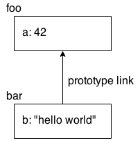

## `this` Identifier

Another very commonly misunderstood concept in JavaScript is the `this` identifier. Again, there's a couple of chapters on it in the *this & Object Prototypes* title of this series, so here we'll just briefly introduce the concept.

While it may often seem that `this` is related to "object-oriented patterns," in JS `this` is a different mechanism.

If a function has a `this` reference inside it, that `this` reference usually points to an `object`. But which `object` it points to depends on how the function was called.

It's important to realize that `this` *does not* refer to the function itself, as is the most common misconception.

Here's a quick illustration:

```js
function foo() {
	console.log( this.bar );
}

var bar = "global";

var obj1 = {
	bar: "obj1",
	foo: foo
};

var obj2 = {
	bar: "obj2"
};

// --------

foo();				// "global"
obj1.foo();			// "obj1"
foo.call( obj2 );		// "obj2"
new foo();			// undefined
```

There are four rules for how `this` gets set, and they're shown in those last four lines of that snippet.

1. `foo()` ends up setting `this` to the global object in non-strict mode -- in strict mode, `this` would be `undefined` and you'd get an error in accessing the `bar` property -- so `"global"` is the value found for `this.bar`.
2. `obj1.foo()` sets `this` to the `obj1` object.
3. `foo.call(obj2)` sets `this` to the `obj2` object.
4. `new foo()` sets `this` to a brand new empty object.

Bottom line: to understand what `this` points to, you have to examine how the function in question was called. It will be one of those four ways just shown, and that will then answer what `this` is.

**Note:** For more information about `this`, see Chapters 1 and 2 of the *this & Object Prototypes* title of this series.

## Prototypes

The prototype mechanism in JavaScript is quite complicated. We will only glance at it here. You will want to spend plenty of time reviewing Chapters 4-6 of the *this & Object Prototypes* title of this series for all the details.

When you reference a property on an object, if that property doesn't exist, JavaScript will automatically use that object's internal prototype reference to find another object to look for the property on. You could think of this almost as a fallback if the property is missing.

The internal prototype reference linkage from one object to its fallback happens at the time the object is created. The simplest way to illustrate it is with a built-in utility called `Object.create(..)`.

Consider:

```js
var foo = {
	a: 42
};

// create `bar` and link it to `foo`
var bar = Object.create( foo );

bar.b = "hello world";

bar.b;		// "hello world"
bar.a;		// 42 <-- delegated to `foo`
```

It may help to visualize the `foo` and `bar` objects and their relationship:



The `a` property doesn't actually exist on the `bar` object, but because `bar` is prototype-linked to `foo`, JavaScript automatically falls back to looking for `a` on the `foo` object, where it's found.

This linkage may seem like a strange feature of the language. The most common way this feature is used -- and I would argue, abused -- is to try to emulate/fake a "class" mechanism with "inheritance."

But a more natural way of applying prototypes is a pattern called "behavior delegation," where you intentionally design your linked objects to be able to *delegate* from one to the other for parts of the needed behavior.

**Note:** For more information about prototypes and behavior delegation, see Chapters 4-6 of the *this & Object Prototypes* title of this series.

## Old & New

Some of the JS features we've already covered, and certainly many of the features covered in the rest of this series, are newer additions and will not necessarily be available in older browsers. In fact, some of the newest features in the specification aren't even implemented in any stable browsers yet.

So, what do you do with the new stuff? Do you just have to wait around for years or decades for all the old browsers to fade into obscurity?

That's how many people think about the situation, but it's really not a healthy approach to JS.

There are two main techniques you can use to "bring" the newer JavaScript stuff to the older browsers: polyfilling and transpiling.

### Polyfilling

The word "polyfill" is an invented term (by Remy Sharp) (https://remysharp.com/2010/10/08/what-is-a-polyfill) used to refer to taking the definition of a newer feature and producing a piece of code that's equivalent to the behavior, but is able to run in older JS environments.

For example, ES6 defines a utility called `Number.isNaN(..)` to provide an accurate non-buggy check for `NaN` values, deprecating the original `isNaN(..)` utility. But it's easy to polyfill that utility so that you can start using it in your code regardless of whether the end user is in an ES6 browser or not.

Consider:

```js
if (!Number.isNaN) {
	Number.isNaN = function isNaN(x) {
		return x !== x;
	};
}
```

The `if` statement guards against applying the polyfill definition in ES6 browsers where it will already exist. If it's not already present, we define `Number.isNaN(..)`.

**Note:** The check we do here takes advantage of a quirk with `NaN` values, which is that they're the only value in the whole language that is not equal to itself. So the `NaN` value is the only one that would make `x !== x` be `true`.

Not all new features are fully polyfillable. Sometimes most of the behavior can be polyfilled, but there are still small deviations. You should be really, really careful in implementing a polyfill yourself, to make sure you are adhering to the specification as strictly as possible.

Or better yet, use an already vetted set of polyfills that you can trust, such as those provided by ES5-Shim (https://github.com/es-shims/es5-shim) and ES6-Shim (https://github.com/es-shims/es6-shim).

### Transpiling

There's no way to polyfill new syntax that has been added to the language. The new syntax would throw an error in the old JS engine as unrecognized/invalid.

So the better option is to use a tool that converts your newer code into older code equivalents. This process is commonly called "transpiling," a term for transforming + compiling.

Essentially, your source code is authored in the new syntax form, but what you deploy to the browser is the transpiled code in old syntax form. You typically insert the transpiler into your build process, similar to your code linter or your minifier.

You might wonder why you'd go to the trouble to write new syntax only to have it transpiled away to older code -- why not just write the older code directly?

There are several important reasons you should care about transpiling:

* The new syntax added to the language is designed to make your code more readable and maintainable. The older equivalents are often much more convoluted. You should prefer writing newer and cleaner syntax, not only for yourself but for all other members of the development team.
* If you transpile only for older browsers, but serve the new syntax to the newest browsers, you get to take advantage of browser performance optimizations with the new syntax. This also lets browser makers have more real-world code to test their implementations and optimizations on.
* Using the new syntax earlier allows it to be tested more robustly in the real world, which provides earlier feedback to the JavaScript committee (TC39). If issues are found early enough, they can be changed/fixed before those language design mistakes become permanent.

Here's a quick example of transpiling. ES6 adds a feature called "default parameter values." It looks like this:

```js
function foo(a = 2) {
	console.log( a );
}

foo();		// 2
foo( 42 );	// 42
```

Simple, right? Helpful, too! But it's new syntax that's invalid in pre-ES6 engines. So what will a transpiler do with that code to make it run in older environments?

```js
function foo() {
	var a = arguments[0] !== (void 0) ? arguments[0] : 2;
	console.log( a );
}
```

As you can see, it checks to see if the `arguments[0]` value is `void 0` (aka `undefined`), and if so provides the `2` default value; otherwise, it assigns whatever was passed.

In addition to being able to now use the nicer syntax even in older browsers, looking at the transpiled code actually explains the intended behavior more clearly.

You may not have realized just from looking at the ES6 version that `undefined` is the only value that can't get explicitly passed in for a default-value parameter, but the transpiled code makes that much more clear.

The last important detail to emphasize about transpilers is that they should now be thought of as a standard part of the JS development ecosystem and process. JS is going to continue to evolve, much more quickly than before, so every few months new syntax and new features will be added.

If you use a transpiler by default, you'll always be able to make that switch to newer syntax whenever you find it useful, rather than always waiting for years for today's browsers to phase out.

There are quite a few great transpilers for you to choose from. Here are some good options at the time of this writing:

* Babel (https://babeljs.io) (formerly 6to5): Transpiles ES6+ into ES5
* Traceur (https://github.com/google/traceur-compiler): Transpiles ES6, ES7, and beyond into ES5

## Non-JavaScript

So far, the only things we've covered are in the JS language itself. The reality is that most JS is written to run in and interact with environments like browsers. A good chunk of the stuff that you write in your code is, strictly speaking, not directly controlled by JavaScript. That probably sounds a little strange.

The most common non-JavaScript JavaScript you'll encounter is the DOM API. For example:

```js
var el = document.getElementById( "foo" );
```

The `document` variable exists as a global variable when your code is running in a browser. It's not provided by the JS engine, nor is it particularly controlled by the JavaScript specification. It takes the form of something that looks an awful lot like a normal JS `object`, but it's not really exactly that. It's a special `object,` often called a "host object."

Moreover, the `getElementById(..)` method on `document` looks like a normal JS function, but it's just a thinly exposed interface to a built-in method provided by the DOM from your browser. In some (newer-generation) browsers, this layer may also be in JS, but traditionally the DOM and its behavior is implemented in something more like C/C++.

Another example is with input/output (I/O).

Everyone's favorite `alert(..)` pops up a message box in the user's browser window. `alert(..)` is provided to your JS program by the browser, not by the JS engine itself. The call you make sends the message to the browser internals and it handles drawing and displaying the message box.

The same goes with `console.log(..)`; your browser provides such mechanisms and hooks them up to the developer tools.

This book, and this whole series, focuses on JavaScript the language. That's why you don't see any substantial coverage of these non-JavaScript JavaScript mechanisms. Nevertheless, you need to be aware of them, as they'll be in every JS program you write!

## Review

The first step to learning JavaScript's flavor of programming is to get a basic understanding of its core mechanisms like values, types, function closures, `this`, and prototypes.

Of course, each of these topics deserves much greater coverage than you've seen here, but that's why they have chapters and books dedicated to them throughout the rest of this series. After you feel pretty comfortable with the concepts and code samples in this chapter, the rest of the series awaits you to really dig in and get to know the language deeply.

The final chapter of this book will briefly summarize each of the other titles in the series and the other concepts they cover besides what we've already explored.
